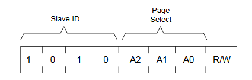
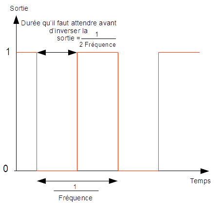
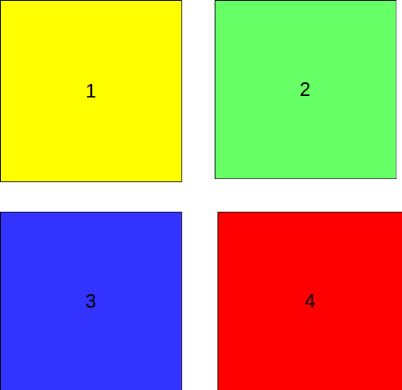
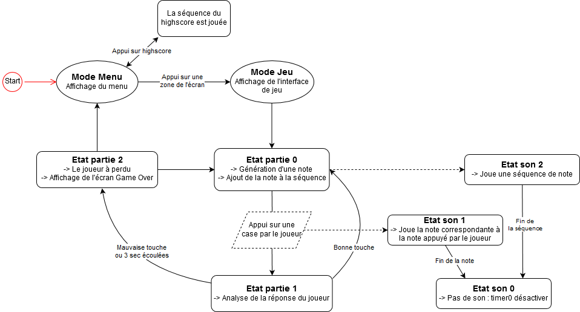

# LPC1768-SimonGame

## Configuration de l’I2C0 
Nous cherchons à implémenter un module I2C de gestion de mémoire, afin de pouvoir mémoriser le meilleur score. Pour cela, nous avons analysé les échanges effectués lors de son utilisation. (en étudiant la datasheet) Cela nous a permis de comprendre le fonctionnement du module; c’est-à-dire les échanges maître-esclave. En effet, il existe deux types d’échange : 
  - La lecture dans la mémoire;
  - L’écriture dans  la mémoire.
Dans chacun de ces échanges, le maître doit écrire l’adresse (codée sur 11 bits) à laquelle il souhaite écrire ou lire. Celle-ci se décompose en 2 adresses : les 3 bits de poids forts sont transmis dans l’adresse esclave, et les 8 derniers bits sont transmis en données.

__Figure 1 : Composition de l’adresse esclave__

Le huitième bit de cette adresse esclave vaut 1 si nous effectuons une lecture et 0 si nous effectuons une écriture. 

De plus, chaque échange est ponctué par un start, un stop et des acknowledges : 
Stop : quand le SCL est à 1 et que le SDA passe de 0 à 1. Opération en cours est interrompue. Le maître doit avoir la main sur le SDA

Start : SDA de 1 à 0 et SCL à 1. Tous les échanges commencent avec un Start. Nous pouvons interrompre une opération avec un start → cela prépare pour une nouvelle opération

Acknowledge : Apparaît après le transfert du 8eme bit pour n'importe quel échange. Le transmetteur perd la main sur le SDA afin que le receveur la prenne. Le receveur garde le SDA à 0 pour signaler la réception de l'octet. L'opération est interrompue si le receveur ne garde pas le SDA à 0 : cela peut être dû à une erreur de transfert de l'octet (cela permet que l'octet soit renvoyé) ou cela peut-être délibéré lors d'un read car cela provoquerait une tentative d'avoir la main sur le bus pendant que le maître envoie une autre commande.

## Génération d'une note

Il faut tout d’abord trouver une fréquence qui correspondrait à chaque touche de couleur (4 fréquences à choisir).
Nous avons décidé d’attribuer la fréquence suivante aux différentes zones :
  -La : 	440 Hz	
  -Do : 	261 Hz
  -Re : 	294 Hz
  -Sol : 	392 Hz
	Pour réussir à produire un son nous allons utiliser le timer 0, et nous allons inverser la valeur du port P1,9 (qui correspond au haut parleur), à chaque fois que le timer compte un temps égal à   . Comme on peut le voir avec le schéma suivant :
  

__Figure 2 : Schéma explicatif pour la génération d’une note.__

Nous allons pour cela devoir mettre notre timer sur interruption, nous allons utiliser des bibliothèques créées par le constructeur du micro contrôleur pour réaliser l’initialisation du timer. Cette partie a été la plus dure pour la génération d’une note, en pratique il suffit d’autoriser les interruptions, de mettre en place des valeurs de match et du prescaler pour obtenir le résultat qu’on veut avec la précision souhaitée.

Cependant une fois qu’on commence à chercher la fonction qui permet d’initialiser le timer nous nous rendons compte du travail fastidieux de retrouver la bonne fonction, les bons paramètres à donner. Nous avons notamment pu constater qu’il était nécessaire de lire dans le détail ce que faisait chaque fonction. Par exemple, nous avons passé beaucoup de temps pour nous rendre compte que nous n’avions pas dit au processeur qu’il allait devoir gérer le timer en interruption car il nous semblait normal que ce soit fait dans la fonction d’initialisation quand on avait spécifié qu’on voulait que le timer parte en interruption à chaque match.

Une fois que nous avons mis en place l’initialisation du timer, nous avons écrit l’interruption du timer 0. Pour nous simplifier la programmation du timer et éviter que le prescaler puisse dépasser la valeur de match et crée des problèmes (besoin d’attendre un temps suffisamment long pour que le prescaler reboucle car il a dépassé la valeur du match register), nous avons décidé de créer un compteur (ctp_note) qui va s’incrémenter à chaque fois que le timer va partir en interruption. Et une fois que ce compteur a dépassé une certaine valeur alors on le remet à 0 et on inverse la valeur du port du haut parleur. Ainsi si l’on veut changer la fréquence il nous suffit de changer la valeur à comparer. De plus si l’on souhaite changer la précision de la fréquence de notre son on peut maintenant juste changer la valeur du match register !

  ## Ecran tactile LCD
  L’écran tactile utilise une interface SPI pour communiquer avec la carte ainsi que le port P0 .19 qui est à 0 lorsque l’on appuie sur l'écran.
  
### a) LCD affichage

L’initialisation de l’affichage est faite par la procédure fournie lcd_Initialiation() au début du main. L’écriture de chaînes de caractères est faite par la fonction LCD_write_english_string
Le dessin d’un rectangle d’une couleur choisie par la fonction dessiner_rect

### b) LCD tactile

L’initialisation de la partie tactile de l’écran est faite par la procédure touch_init()
Lorsque le port P0 .19 est à 0 cela signifie qu’il y a un appui. Lorsque le port est à 1 cela indique qu’il n’y a pas d’appui. Les coordonnées du dernier appui sont stockés dans les variables globales touch_x et touch_y. Pour les mettres à jour lors de l’appui on utilise la procédure touch_read() qui utilise la liaison SPI. (Serial Peripheral Interface)

On utilise un timer pour scruter le port P0.19 toutes les 100 ms et ainsi regarder si il y a eu un appui. Ce temps semble cohérent, il ne sert à rien de scruter trop rapidement et ainsi utiliser les ressources de la carte pour rien.
Le timer1 est utilisé en interruption toutes les 20ms pour plusieurs utilisations par la suite. Il faut donc utiliser un compteur dans l'interruption pour avoir une scrutation du port toutes les 100 ms.

Par la suite on utilisera des flags pour commencer à réaliser un automate. Lorsque les 100ms sont atteintes, on passe le flagtacheclavier à 1 si le port  P0.19 est à 0. Ce flag signifie qu’il y a eu un appui.

## 5/ Émission de la note liée à la zone d’appui et sauvegarde des appuis successifs.
### a) Détection d’un appui

  Pour détecter un appui on va utiliser le fait qu’on scrute à chaque fois qu’on part en interruption avec le timer1. Pour savoir si l’utilisateur a appuyé on doit se souvenir de la valeur du port 0.19 et la comparer avec ce qu'elle vaut dans l’interruption, si elle est différente alors ça veut dire qu’il y a eu un changement sur la zone d’appui de l’écran, on va donc lever le drapeau flag_changement. Une fois ce drapeau levé on regarde quelle est la valeure du port, si elle est à 0 alors c’est qu’on vient d’appuyer, à 1 on vient de relâcher notre appui.

### b) Détection de la zone d’appui

Une fois qu’on a réussi à détecter un appui et un relâchement, on va devoir regarder ou l’on appuie, pour cela nous allons créer une tâche logiciel qui va mettre à jour un flag_couleur qui va valoir 1, 2, 3 ou 4 selon la zone :

__Figure 3 : Les différentes zones du jeu SIMON__

### c) Génération d’une note en fonction de la zone

  Une fois le flag_couleur mis à jour, on va utiliser une autre tâche logiciel son qui va jouer un son correspondant à la zone d’appui. On va définir un état_son  à 1 qui correspond à jouer une note qui correspond à la valeur du flag_couleur.
A ce niveau de programmation on arrive à générer une note en fonction de l’endroit où l’on appuie, le problème est que la note est joué de façon continue, c’est pour ça que nous avons créé un état_son à 0 qui va arrêter le son, pour se faire nous avons dans un premier temps proposé de mettre la fréquence à 0, puis nous avons décidé que, comme nous n'utilisons pas le timer 0 pour autre chose, nous pouvons nous permettre de désactiver les interruptions sur le timer 0. Ensuite on va dire qu’une fois qu’on a détecté que l’utilisateur a relâché son appui sur l’écran alors on va appeler la tâche son dans l’état 0 et on arrête ainsi le son. 
Pour arrêter le mode au bout de 3 secondes nous allons utiliser le timer 1. Nous allons mettre un flag_wait qui vaut -1 quand nous n’avons rien à attendre ou le temps qu’on souhaite  attendre en s. Une fois que nous avons lancé le son dans la tache son on met le flag_wait à 3 et l’on met dans l’interruption du timer 1 que quand les 3 secondes sont passées et qu’on était dans l’état son 1 alors on passe à l’état son 0 ce qui nous fait arrêter la musique au bout de 3 secondes.

Une fois cette petite application réalisée nous avons changé les tâches logiciels, nous allons donc voir dans la partie suivante comment nous avons mis en place nos différentes tâches logiciels pour construire l’application.
  
##  6/Construction de l’application complète.
### a) Création des différentes tâches
Pour la création de l’application complète nous avons décidé de définir 3 tâches logiciels :

- La tâche_jeu qui va faire avancer la partie :	
   - Dans l’état 0 : Elle va gérer la création de la série de note à jouer 	
   - Dans l’état 1 : Elle va faire les comparaisons entre la touche sur laquelle le joueur appuie et celle sur laquelle il faut appuyer pour avancer dans le jeu. 
   - Dans l’état 2: Elle va terminer la partie et réinitialiser toute les variables 
-La tâche_clavier qui va permettre de savoir sur quelle touche le joueur a appuyé.
- La tâche_son va soit générer un son de deux façons différents :
  - Dans l’état 1 : On joue le son correspondant à la touche sur laquelle l’utilisateur a appuyé	
  - Dans l’état 2 : On joue la série de notes stockée dans le tableau.
  
###  b) Fonctionnement détaillé de l’application

Après avoir réfléchi à ces 3 tâches, on va décrire le fonctionnement du jeu :

Initialisation :

  - On met l’état de la partie à 0 car il faut générer une note.
  - On lève le flag de la tâche_jeu

Début du programme :
  - On a levé le flag de la tâche jeu qui va donc se réveiller, l’état de la partie étant à 0, on va créer une note et la stocker dans un tableau, puis on va lever le drapeau pour appeler la tâche son dans l’état 2 pour jouer la série de note et passer dans l’état 2 de la partie.

  - On a levé le flag de la tâche son qui va se réveiller et jouer la série de note, une fois la série joué on veut compter 3 secondes, pour cela on va utiliser notre flag_wait et sortir de la boucle
  
  - Une fois la série jouée il y a un embranchement :
  
  1/ Si le joueur appuie sur une touche avant la fin des 3 secondes :
    - Cela va appeler la tâche clavier qui va lire où l’utilisateur a appuyé et appeler la tâche jeu.
    - La tâche jeu est appelée, elle regarde si la touche est la bonne si c’est le cas et que le joueur n’a pas appuyé sur toutes les touches, elle passe le flagcouleur à -1 pour éviter des bugs, puis elle s’arrête, si le joueur a fini la série alors l’état de la partie passe à 0 et on réinitialise le compteur. Si le joueur se trompe on termine la partie.
    
  2/ Si le joueur n’appuie sur aucune touche pendant 3 secondes.
    - Le timer 1 va partir en interruption et va suffisamment incrémenter le compteur qui va arriver à 3 secondes , comme on utilise ce compteur pour compter plusieurs événements on est obligé de discriminer le cas dans lequel on est, on est en train d’analyser la réponse de l’utilisateur c’est à dire dans l’état 1 de la partie, on a donc attendu plus de 3 secondes, on va donc finir la partie.

Arrivé à ce niveau on a décrit tout le cheminement du programme, nous pouvons résumer tout ça par le schéma suivant :

__Figure 4 : Schéma du fonctionnement du programme__

